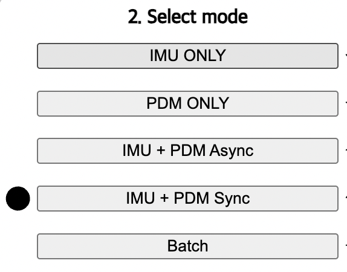

In the provided .html file, there exists 5 different modes in transmission.

* `IMU_ONLY` : real-time streaming of IMU data only
* `PDM_ONLY` : real-time streaming of PDM(16 kHz, 16 bit) mic data only
* `IMU_PDM Asynchronized` : real-time streaming of both IMU and PDM data. IMU and PDM data is transmitted in different packets
* `IMU_PDM Synchronized` : real-time streaming of both IMU and PDM data. IMU and PDM data is transmitted in a same packet
* `Batch` : buffered data transmission.

# User manual for .html file utilization
The website which is designed with provided .html file is composed of toal 4 steps. These steps are distinguisted with white rectangular boxes, so it is straight forward to find each steps.

## 1. BLE device connection establishment

Press `Connect Device` botton in order to connect BLE device to your PC. If BLE peripheral device does not appear, you should follow below steps.

In this process, the BLE service name that advertised by MCU board should be exactly same with the service name specified in `WebClinet/callback.js` file line 8. 

```
myBLE.connect(serviceUUID, "XIAO nRF52840 Sense", gotCharacteristics);
```

Currently, the name of the service is `XIAO nRF52840 Sense`, but this service name can be changed if you are using another MCU board. Then, use nRF connect application on your mobile phone to check the BLE service name of your MCU board. 

## 2. Choose data transmission mode

After the BLE connection is established, you should choose the data transfer mode to initiate the data collection service.
By pressing each button, the data transfer mode will be changed immediately, and the small black circle will indicates the current mode you are using.



## 3. Start/Stop record

In the step 3, IMU_ONLY, PDM_ONLY, IMU_PDM Async, IMU_PDM Sync modes are real-time streaming system, but Batch mode is not. Therefore, real-time streaming mode and batch mode uses different recording control button, start recording, and batch record respectively. Currently, batch recording time is adjusted to 2 seconds, but it can be modified in the .ino Arduino code's `batch_recording_time` variable. The maximum value of `batch_recording_time` is 4 sec, but it can be differ by the size of MCU's RAM memory.

In the step 3 of batch mode, visual feedback is implemented in order to notify the current status of data transmission to the users. Batch mode is composed of below three steps, `STANBY`, `RECORDING`, and `RECEIVING`.

* `STANBY(GREEN)` : Ready to collect data. Press `batch record` button to initiate data collection.
* `RECORDING(RED)` : MCU board collects data & save it to its RAM memory.
* `RECEIVING(BLUE)` : MCU board is sending collected data to central device(PC).
  
For the safe and reliable data collection, `batch record` button should be pressed only when the STANBY green light is changed to deep green.


## 4. Check/download the received data

After the recording process is finished, verifing and downloading data is also possible. By pressing `Play Sound` button, the most recently recorded audio file will be played. `Download Data` button enables download of audio file amd IMU data as .wav file and .csv file, respectively.
