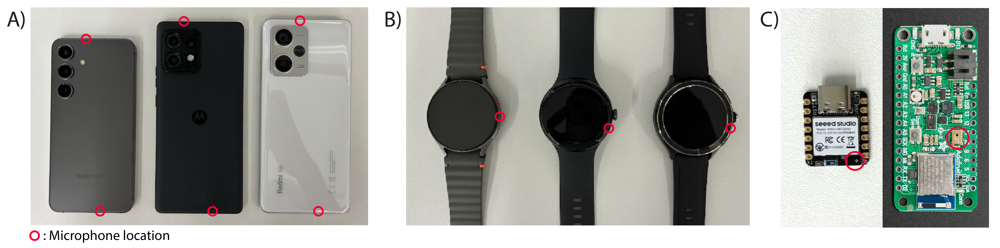

# OpenAcoustics

## Publications
If you use this code in your reseach, please cite our open-source project: 
```
@inproceedings{OpenAcoustics_25_Kim,
author = {Kim, Jiwan and Jung, Hohurn and Oakley, Ian},
title = {OpenAcoustics: An Open-Source Framework for Acoustic Data Capture on Smart Devices and Microcontrollers},
year = {2025},
}
```

##     
 OpenAcoustics support following platforms and more. (A) Smartphones (left to right: Samsung Galaxy S24, Motorola Edge 40, and Xiaomi Redmi Note 12 Pro), (B) Smartwatches (Samsung Galaxy Watch 7, Google Pixel Watch 3, and Xiaomi Watch Pro 2), and (C) MCUs (XIAO nRF52840 Sense and Arduino Nano 33 BLE Sense Rev2)


## High-fidelity audio capture on mobile devices
Supports 48 kHz, 16-bit PCM audio recording on Android smartphones, which enables stereo recording using two microphones (e.g., top and bottom), and on smartwatches, which support mono recording with a single built-in microphone. Data transmission is performed via Wi-Fi using TCP.

## Low-power audio capture on MCUs
Enables 16 kHz, 16-bit PCM audio recording on low-cost MCUs with data transmission over Bluetooth Low Energy (BLE) using Universal Asynchronous Receiver/Transmitter (UART).

## Multimodal sensing support
Provides optional motion data capture using built-in IMU sensors, allowing synchronized collection with audio signals. 

## Real-time transmission
Supports both real-time streaming and buffered transmission to mitigate data loss during wireless transfer.